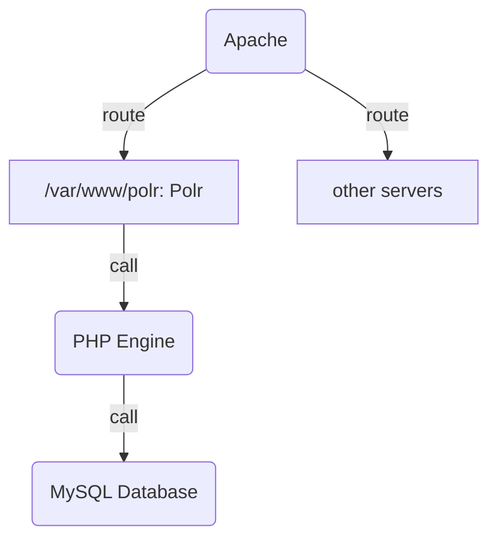
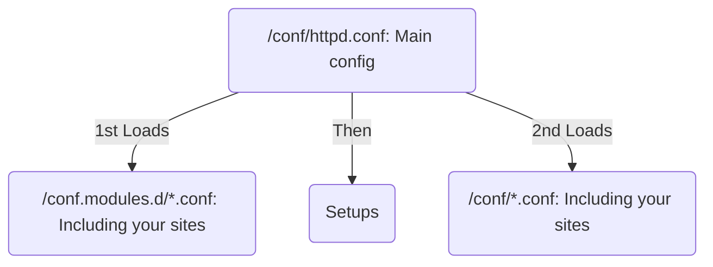

## A Comprehensive Tutorial: Host Your Own Link Shortener

##### Server Configuration

我使用的是华为云的主机（2 Core/4G RAM），基于Fedora发行版和``dnf``/``yum``包管理器（使用[BFSU镜像](https://mirrors.bfsu.edu.cn/help/fedora/)）。注意Apache2在RedHat系（Fedora，CentOS， OpenSUSE etc.)的配置和Ubuntu/Debian系不一样（前者使用``LoadModule``，后者可以额外使用``a2enmod``/``a2dismod``）。有防火墙配置的云服务提供商使用的时候必须要在提供商面板处放行你要用的端口。

你能得到什么：

1. 一个自己的链接缩短器
2. 配置Apache和SQL的基础知识

##### Apache2 Install

安装本宇宙最为广泛使用的服务器之一Apache2

```shell
sudo dnf update
sudo dnf install httpd
```

启用和启动Apache服务``httpd`` （注：在Debian/Ubuntu上是``apache2``）

```shell
sudo systemctl enable httpd
sudo systemctl start httpd
```

##### PHP Install

安装本宇宙最好的编程语言PHP（目前的稳定版本是PHP7.3，这个版本号有点问题，似乎是``dbal``库的版本兼容性问题，之后会讲到）

```shell
sudo dnf install php php-common php-mysqlnd php-pear php-mbstring
```

你可以试试PHP和Apache2了！Apache默认设置是在``\var\www\html``下保存静态网站， 你可以在这个目录里面编辑并保存一文件``info.php``，内容大概就是PHP的Hello World

```php
<?php
    phpinfo();
?>
```

然后也许需要重启一下Apache（一般配置阶段做了修改最好都重启下）

```shell
sudo systemctl restart httpd
```

然后访问``http://localhost/info.php``,就可以看到一个紫色的PHP Info页面了！

如果发现不行（网页显示出了纯文本的PHP代码），则为了让Apache不把PHP文件直接显示出来而是用PHP引擎执行，可能还需要在Apache主配置文件``/etc/httpd/conf/httpd.conf``里设置，在其中找到``<IfModule mime_module>``块如下加入几行

```apache
<IfModule mime_module>
	# ...
    AddType application/x-httpd-php .php
    AddType application/x-httpd-phps .phps
    # ...
</IfModule>
```

如果还是不行（还是显示PHP代码），那么可能是没有加载Apache PHP插件的动态库，检查PHP Module配置文件``/etc/httpd/conf.modules.d/**-php.conf``，并加入

```apache	
LoadModule php7_module modules/libphp7.so
```

或者使用这个完整的配置文件

```apache
#
# PHP is an HTML-embedded scripting language which attempts to make it
# easy for developers to write dynamically generated webpages.
#

# Cannot load both php5 and php7 modules
<IfModule !mod_php5.c>
  <IfModule prefork.c>
    LoadModule php7_module modules/libphp7.so
  </IfModule>
</IfModule>


<IfModule !mod_php5.c>
  <IfModule !prefork.c>
    # ZTS module is not supported, so FPM is preferred
    # LoadModule php7_module modules/libphp7-zts.so
  </IfModule>
</IfModule>
<FilesMatch "\.*">
SetHandler application/x-httpd-php
</FilesMatch>
```

有[可能](https://stackoverflow.com/questions/49839993/error-apache-is-running-a-threaded-mpm-but-your-php-module-is-not-compiled-t)会报错（就是发现apache启动失败，然后这时候检查``httpd -M``会报错``Apache is running a threaded MPM, but your PHP Module is not compiled to be threadsafe. You need to recompile PHP``)这个时候需要更改``LoadModule``加载模块的方式：用被注释的

```apache
LoadModule mpm_prefork_module modules/mod_mpm_prefork.so
```

替换（将这一行注释）

```apache
LoadModule mpm_event_module modules/mod_mpm_event.so
```

这一行可能在``conf/httpd.conf``里，也可能在``conf.modules.d/**-mpm.conf``里，不要直接在文件里加，``mpm``模块不能重复/冲突加载。

为了能够重定向，可能需要在总配置里最外层加入一行

```apache
RewriteEngine on
```

##### MySQL/MariaDB Install [Reference](https://docs.fedoraproject.org/en-US/quick-docs/installing-mysql-mariadb/)

从Oracle的官方Repository安装

```shell
sudo dnf install https://repo.mysql.com//mysql80-community-release-fc31-1.noarch.rpm
sudo dnf install mysql-community-server
```

从Fedora Repository安装

```shell
sudo dnf install {community-mysql-server|mariadb-server}
```

启用MySQL服务 ``mysqld``或者``mariadb``

```shell
sudo systemctl enable {mysqld|mariadb}
sudo systemctl start  {mysqld|mariadb}
```

为了初始化，找到预置密码, 注意！MySQL比MariaDB设置密码要求更严格（好像默认是大小写+特殊符号数字都有，而且默认认证方式是带插件的，Polr只支持plain password，所以是MySQL的话后面还需要设置！ [Reference](https://stackoverflow.com/questions/52364415/php-with-mysql-8-0-error-the-server-requested-authentication-method-unknown-to)）

```shell
sudo grep 'temporary password' /var/log/mysqld.log
```

使用脚本初始化数据库

```shell
sudo mysql_secure_installation
```

现在你可以使用MySQL了，注意``-p``选项表示你接着要输入密码，由于你肯定给数据库上了密码，所以必须加这个选项，否则为认为你用无密码登录直接拒绝连接。

```shell
sudo mysql -u root -p
```

试试看(正如在数据库课程中学到的）！

```mysql
show databases;
create database db1;
use db1;
create table tab;
select * from table tab;
```

如其前文所提到的，在mysql的控制台里更改为默认验证方式(把``'password'``改成你的密码！)

```mysql
ALTER USER 'root'@'localhost' IDENTIFIED WITH mysql_native_password
BY 'password';  
FLUSH PRIVILEGES; # probabaly needed
```

##### POLR Install [Reference](https://docs.polrproject.org/en/latest/user-guide/installation/)

> **Server Requirements**
>
>
> - Apache, nginx, IIS, or lighttpd (Apache preferred)
> - PHP >= 5.5.9
> - MariaDB or MySQL >= 5.5, SQLite alternatively
> - composer
> - PHP requirements:
> - OpenSSL PHP Extension
>    - PDO PHP Extension
>    - PDO MySQL Driver (php5-mysql on Debian & Ubuntu, php5x-pdo_mysql on FreeBSD)
> - Mbstring PHP Extension
> - Tokenizer PHP Extension
> - JSON PHP Extension
> - PHP curl extension
>

如上，在安装polr之前我们需要这些玩意儿，以上安装基本就弄完了。所以开始Polr的安装吧！我为了简化重复劳动，把安装步骤集合成了一个脚本，将以下代码复制成``shell``脚本放在``/var/www``目录下，并``sudo``执行

```shell
git clone https://github.com/Tchekda/polr.git --depth=1
chmod -R 755 polr
chown -R apache polr
cd polr
curl -sS https://getcomposer.org/installer | php
php composer.phar install --no-dev -o
cp -f .env.setup .env
chown -R  apache ../polr
chmod -R 755 ../polr
```

注意，这里使用了这个[PR](/https://github.com/cydrobolt/polr/pull/567)的repository，``dbal``库较新版和PHP7.3可能有版本兼容性问题，所以这个PR限制了这个库的版本来解决这个问题，这个PR还没有merge，所以直接从这个作者fork的repo里拉取。

似乎较新版本的Fedora/带SELinux enforcing的系统还需要这一步骤

```shell
chcon -R -t httpd_sys_rw_content_t polr/storage polr/.env
```

大概组成是这样的：``git clone``拉下来代码到``polr``文件夹，拉下来``composer``，用``composer``安装必要的库，**让``apache``用户获得polr文件夹的所有权**（这很重要，不然Apache没有权限访问这里的数据，并且在Debian/Ubuntu上是``www-data``用户），初始化``.env``文件（配置文件）

然后来配置Apache路由，新建一个Virtual Host配置，如``/conf.modules.d/polr.conf``

```apache
<VirtualHost *:80>
    ServerName example.com
    # ServerAlias www.example.com # 可选的,如果你要把其他（子）域名也绑定到你的Polr
	RewriteEngine on
    DocumentRoot "/var/www/polr/public"
    <Directory "/var/www/polr/public">
        Require all granted
        Options Indexes FollowSymLinks
        AllowOverride All
        Order allow,deny
        Allow from all
    </Directory>
</VirtualHost>
```

把其中的``exmple.com``换成你想要的地址即可，比如``localhost``，不过一般你得有个域名来作为Link Shortener的URL，那么把你的域名替换即可，如果不想用主域名，可以用子域名（如``s.exmaple.com``)

好了，现在打开浏览器访问``yoursite.com/setup``然后简单的设置一下就可以了！注意，设置完了这里的配置基本就改不了了，这也是为什么我写了一个设置脚本，你可以删除``polr``文件夹后一键重新安装！

**大功告成，你成功建立了一个URL缩短器。That's what called a geek! Congrats！**

###### Polr总体上是这么工作的



###### Apache的配置文件总体上是这么工作的



##### More

感谢Linux的万能性，有一个Server你就可以拿来干任何事情。相比树莓派和家用小主机，Linux Server有公网IP，能直接连接域名，x86 Xeon兼容性和性能都是相当不错，实在是太方便了！自己踩玩坑的感想：真-爷青回，这才是Geek嘛，早知道当年初高中多折腾点这些玩意儿不好吗！折腾过FVTT，MC服务器，Polr。以后可能还会折腾：``rclone`` on Cloud，``wordpress``博客的搭建， ``TiddlyWiki``，内网穿透/DDNS...　愿生命不息，折腾不止，RAmen。

